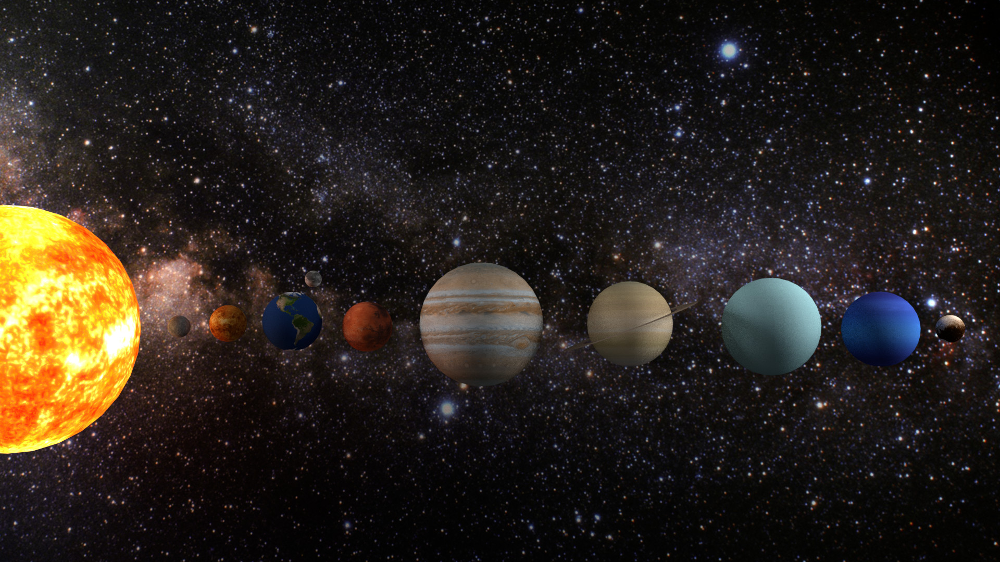

# Solar System Simulator

Final project for the course of Interactive Graphics AY 2018/2019 at La Sapienza University of Rome.

## Team
* Gianmarco Cariggi 

* Marco Costa 

## License
This project is licensed under the MIT License - see the [LICENSE](./LICENSE) file for details

## Documentation
Please see the [DOCUMENTATION](./documentation/documentation.pdf) PDF file for details.

## Demo
Click on the image for the interactive demo

    <a href="https://marco-costa.it/Interactive-Graphics-finalproject/"><a>

